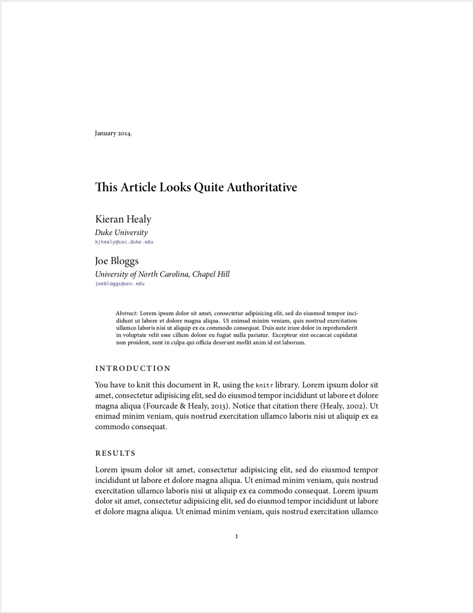
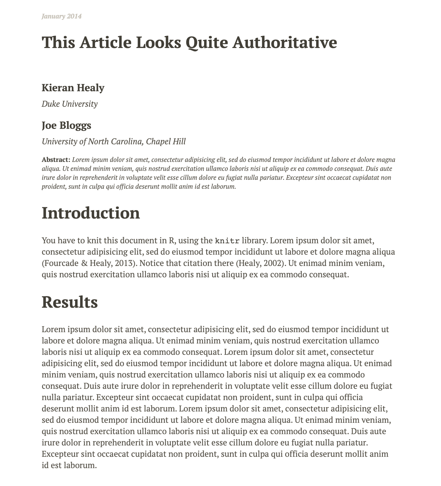
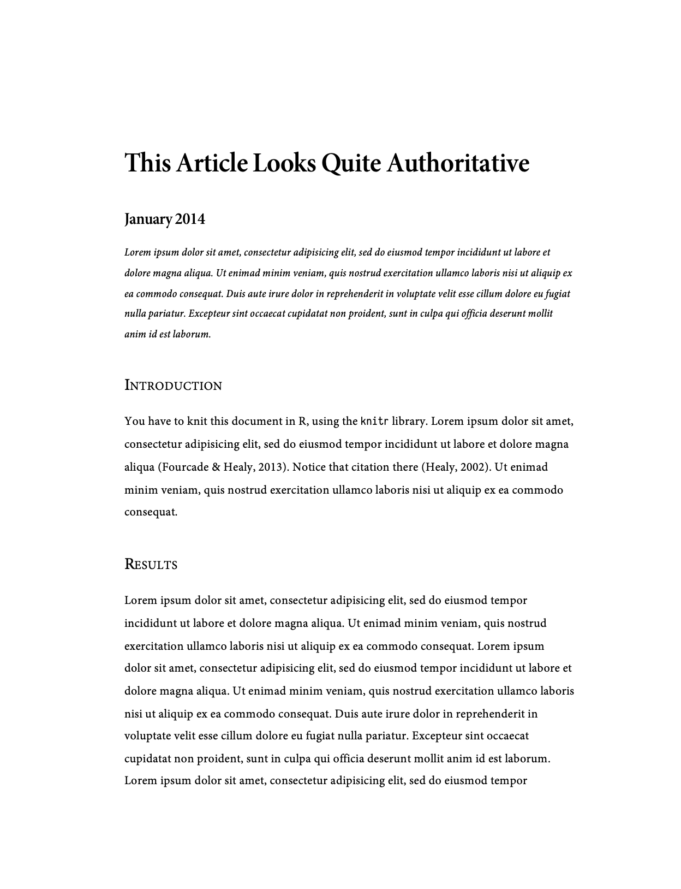

# Pandoc Configuration and Support Files

A collection of support files for use with [pandoc](https://pandoc.org/), and specifically for helping to turn pandoc markdown files into nice HTML, LaTeX, and PDF output. Most of these templates were forked from Kieran Healy and can be found on his [GitHub page](https://github.com/kjhealy). I have tweaked and simplified them as well as added my own. These are meant to be companion to the *Introduction to Plaintext for Research and Writing* which contains a thorough tutorial on the installation and use of these templates. Information about this can be found on my [website](https://timothyelder.com/plaintext)

These files go in your `~/.pandoc/` folder and are designed to work with the style and configuration material provided in [latex-custom-te](https://github.com/TimothyElder/latex-custom-te/). Some files may still rely upon style files available in Kieran's repo [latex-custom-kjh](http://github.com/kjhealy/latex-custom-kjh).

<!-- ## Description

PDF                        |HTML                       | Word
:-------------------------:|:-------------------------:|:-------------------------:
  |    |   -->

## Notes

What's included?

- Some [Pandoc](http://johnmacfarlane.net/pandoc/) templates for an article in PDF (vita LaTeX), HTML, or Microsoft Word. These go in `~/.pandoc/templates`. These can be be pointed to directly with the `--template=` switch as appropriate. The `latex.template` and `xelatex.template` depend on the style files in [latex-custom-kjh](https://github.com/kjhealy/latex-custom-kjh/). The Word reference documents depend on you having Myriad Pro and Minion Pro installed.
- The CSL files in the `csl/` folder format the bibliography generated by pandoc and citeproc. (For simplicity we avoid dealing with biblatex directly at all.) The `chicago-syllabus.csl` file makes a tiny change to a standard Chicago Notes CSL file so you can use it to output citation information in the body text of a document. This makes it useful for lists of references in CVs and course syllabuses. The other three files are APSA, AJPS, and ASA standard files from the main [CSL styles repository](https://github.com/citation-style-language/styles).
- The Makefile in the `makefile/` folder helps you generate HTML, LaTeX, and PDF output from your markdown files in a convenient way. It is meant to go in the folder where you are writing your paper. It looks for `.md` files in the working directory and converts them to nice HTML, PDF, and LaTeX files using the templates provided here, the style files in [latex-custom-kjh](https://github.com/kjhealy/latex-custom-kjh/).
- The `pandoc` commands produced by the current version of the `Makefile` include switches that invoke two [pandoc filters](http://pandoc.org/scripting.html) that do additional processing on the bibliography and cross-references in the document. You should install [pandoc-xnos](https://github.com/tomduck/pandoc-xnos) to make these work.
- The [pwg-template](https://github.com/timothyelder/pwg-template) repository that contains a number of different files and example projects that can be used to get you started and which rely upon these templates.
